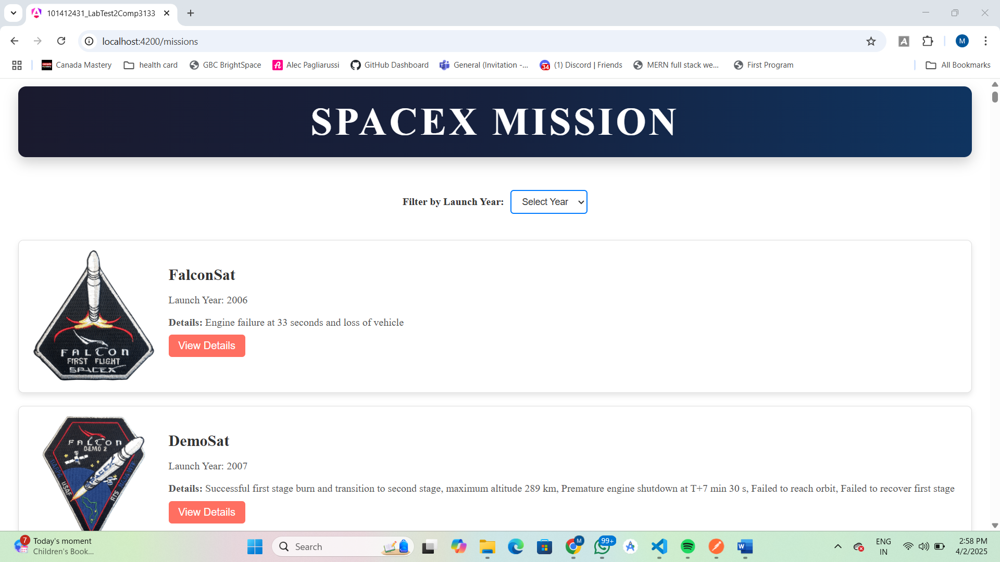
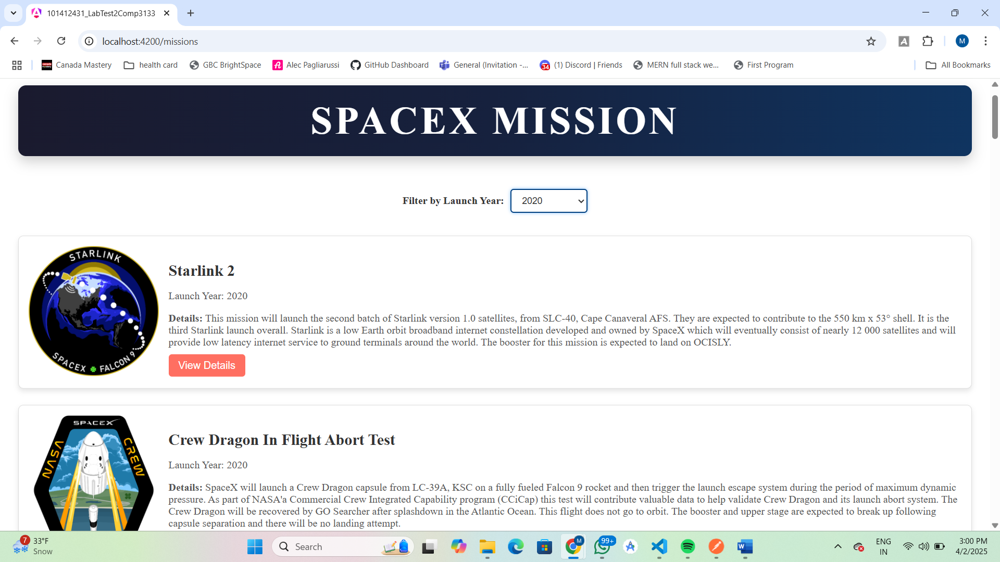
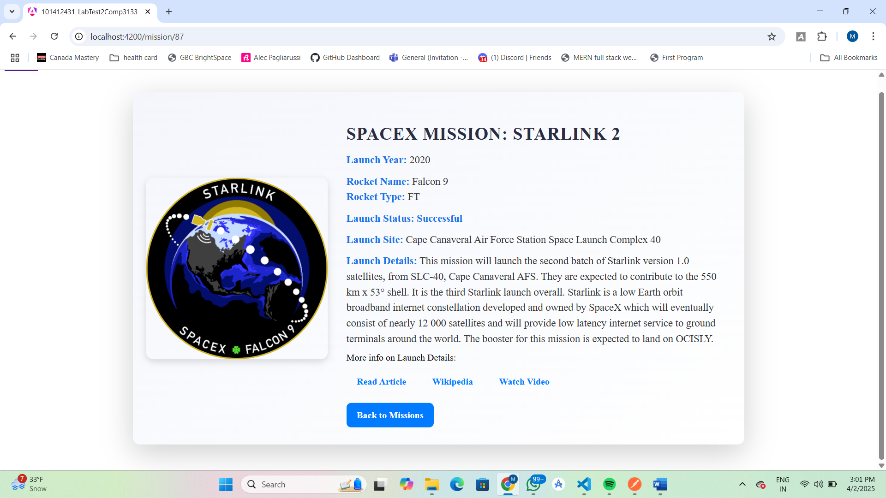

# StudentID Lab Test 2 - COMP3133

This is an Angular application that displays information about SpaceX missions. The application fetches data from SpaceX's REST APIs and allows users to search/filter missions by their launch year. It also provides detailed information about each mission when clicked.

## Table of Contents
- [Project Setup](#project-setup)
- [Features](#features)
- [Components](#components)
- [Deployment](#deployment)

## Project Setup

1. Clone this repository:
   ```sh
   git clone https://github.com/yourusername/studentid-lab-test2-comp3133.git
   cd studentid-lab-test2-comp3133
   ```
2. Install dependencies:
    ```sh
    npm install
    ```
3. Run the application
    ```sh
    ng serve
    ```
    Once the server is running, open your browser and navigate to `http://localhost:4200/`. The application will automatically reload whenever you modify any of the source files.

## Features

- **Display a list of SpaceX missions** with the following details:
  - Flight number
  - Mission name
  - Launch year
  - Mission details
  - Rocket details (name and type)
  - Links to mission-related content:
    - Wikipedia
    - Article link
    - Video link

- **Search or filter missions by launch year** using the mission filter component.

- **Detailed information** is displayed when a mission is selected from the mission list.

## Components

### MissionList Component
- Displays a list of SpaceX missions by fetching data from the SpaceX Launch API.
- Each mission contains the following details:
  - Mission name
  - Launch year
  - Mission details
  - Rocket information
- Provides links to additional mission-related content:
  - Wikipedia
  - Article link
  - Video link

### MissionFilter Component
- Allows users to filter missions by their launch year.
- Emits the selected year to filter the missions shown in the MissionList.

### MissionDetails Component
- Displays detailed information about a specific mission when clicked from the MissionList.

### Service
- A service is used to fetch data from the SpaceX REST API.

### Interface
- A TypeScript interface is used to define the structure of the data fetched from the SpaceX API.

## Screenshots

### Mission List View



### Mission Filter Component



### Mission Details View


